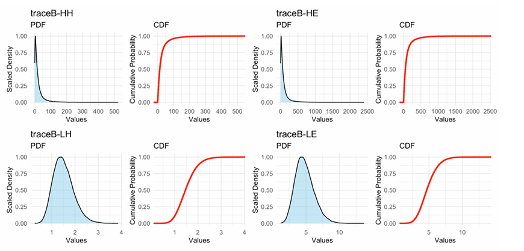
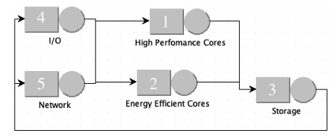
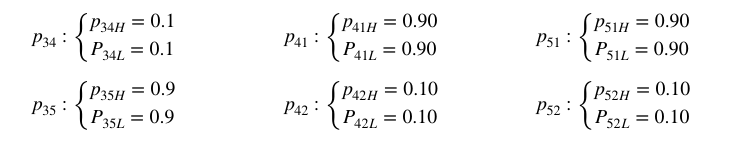
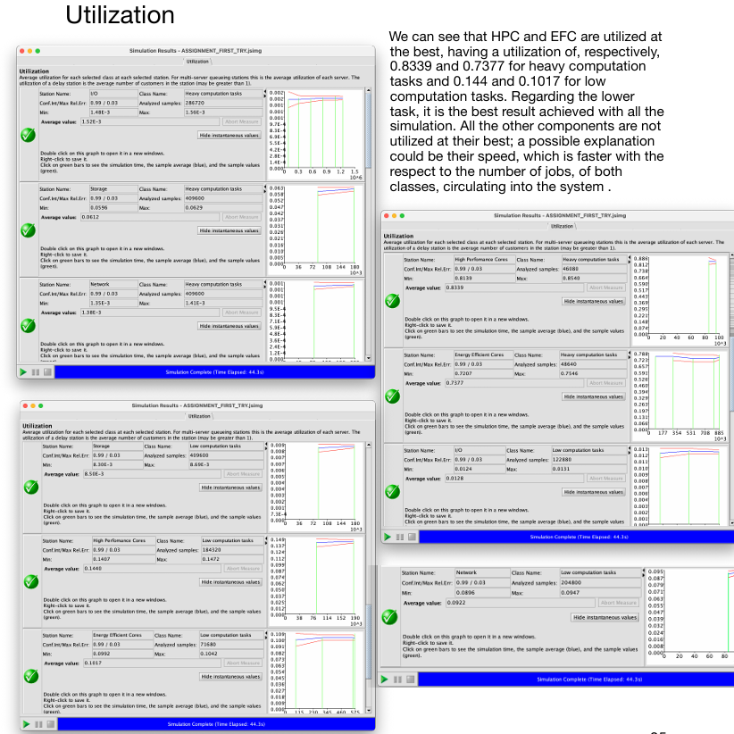
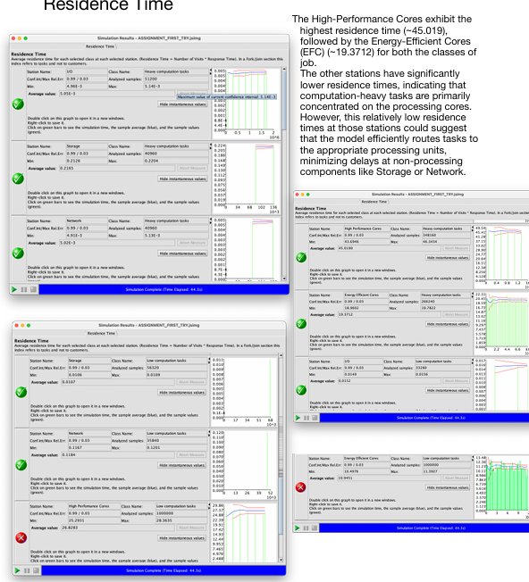

# ARM big.LITTLE Performance Modelling

Group project focused on the performance analysis of an **ARM big.LITTLE heterogeneous processor architecture**, combining statistical workload characterization from real execution traces with closed multi-class queueing-network simulation.

The project was jointly developed end-to-end by the group members.

## Overview

The project follows two main stages:

1. **Workload characterization in R**  
   Execution-time traces were statistically analysed and compared with candidate probability distributions in order to obtain service-time models for different workload/core combinations.

2. **System modelling and simulation in JMT**  
   The heterogeneous architecture was represented as a closed multi-class queueing network and analysed through simulation and parametric what-if studies of routing probabilities.

The objective was to investigate how workload characteristics and routing decisions affect system utilization, residence time, and response time.

---

## 1. Workload Characterization

Four execution traces were analysed, representing heavy- and low-computation jobs running on high-performance and energy-efficient cores.

| Workload | High-Performance Cores | Energy-Efficient Cores |
|---|---|---|
| Heavy computation | `traceB-HH` | `traceB-HE` |
| Low computation | `traceB-LH` | `traceB-LE` |

Each trace contains **50,000 observations**.

The statistical analysis included:

- mean and median
- standard deviation
- median absolute deviation
- range
- skewness
- kurtosis
- standard error
- coefficient of variation
- empirical PDF and CDF
- Q-Q plots
- probability-distribution fitting



*Empirical PDF and CDF analysis for the four workload/core combinations.*

The heavy-computation traces show substantially higher variability and strong positive skew, while the low-computation traces are much more concentrated around their means.

The complete analysis is documented in:

[`docs/workload_characterization.md`](docs/workload_characterization.md)

---

## 2. Service-Time Characterization

Candidate distributions were investigated using analytical properties, coefficient of variation, PDF/CDF comparisons, and Q-Q plots.

The service-time distributions ultimately used in the queueing-network model were:

| Workload / Core | Distribution |
|---|---|
| Heavy — High-Performance | `Gamma(k = 0.469854, θ = 51.346823)` |
| Heavy — Energy-Efficient | `Gamma(k = 0.463838, θ = 208.1773)` |
| Low — High-Performance | `Gamma(k = 12.016235, θ = 0.1250389)` |
| Low — Energy-Efficient | `Gamma(k = 12.257007, θ = 0.394983)` |

These fitted distributions were subsequently used as service-time models for the processor stations.

---

## 3. Closed Multi-Class Queueing Model

The ARM big.LITTLE architecture was represented as a **closed multi-class queueing network**.

Two workload classes were modelled:

- heavy-computation jobs
- low-computation jobs

A closed network was selected because the system operates with fixed job populations.

The model contains five service stations:

- High-Performance Cores
- Energy-Efficient Cores
- Storage
- I/O
- Network



*JMT representation of the closed multi-class model used for the heterogeneous architecture.*

### Processing Resources

The High-Performance Core station contains:

- 8 servers
- FCFS scheduling
- workload-dependent Gamma service times

The Energy-Efficient Core station contains:

- 4 servers
- FCFS scheduling
- workload-dependent Gamma service times

Storage, I/O, and Network are represented as single-server stations using processor-sharing scheduling and exponential service-time distributions.

Detailed model assumptions are available in:

[`docs/queueing_model.md`](docs/queueing_model.md)

---

## 4. Parametric Routing Analysis

The routing probabilities could not be selected solely from the analytical model, so a **parametric what-if study** was performed in JMT.

Routing probabilities were systematically varied while monitoring:

- local utilization
- local residence time
- local response time

The analysis investigated how workload allocation between communication components and processor types affects system performance.

A recurring observation was that the **Energy-Efficient Cores could become a critical resource** when too much workload was routed toward them.

The complete routing analysis is documented in:

[`docs/routing_analysis.md`](docs/routing_analysis.md)

---

## 5. Selected Routing Configuration

Based on the parametric study, the following routing strategy was selected for both workload classes.

After **Storage**:

- 10% → I/O
- 90% → Network

After **I/O or Network**:

- 90% → High-Performance Cores
- 10% → Energy-Efficient Cores



*Routing probabilities selected after the JMT what-if analysis.*

The final model was then simulated using this configuration.

---

## 6. Final Performance Evaluation

### Utilization



*Utilization results for the selected routing configuration.*

For heavy-computation jobs, the reported utilization was approximately:

- **HPC: 0.8339**
- **EFC: 0.7377**

For low-computation jobs:

- **HPC: 0.144**
- **EFC: 0.1017**

The processing cores therefore absorb most of the computational workload while the other stations remain considerably less utilized.

### Residence Time



*Residence-time results for the selected routing configuration.*

The processing cores exhibit the highest residence times, while Storage, I/O, and Network show substantially lower values.

### Response Time


*Response-time results for heavy- and low-computation workloads.*

The Energy-Efficient Cores generally exhibit higher response times than the High-Performance Cores, consistent with their lower-performance design.

The communication stages show substantially lower response times than the processor stations, although Network response time is more significant for the low-computation workload.

---

## Tools & Technologies

- **R**
- Statistical Analysis
- Probability Distribution Fitting
- Descriptive Statistics
- Q-Q Analysis
- Queueing Theory
- Closed Queueing Networks
- Multi-Class Performance Models
- **JMT — Java Modelling Tools**
- Simulation
- Parametric / What-if Analysis
- Performance Evaluation

---

## Repository Structure

```text
arm-big-little-performance-modeling/
│
├── README.md
│
├── figures/
│   ├── trace_distributions.png
│   ├── queueing_model.png
│   ├── selected_routing.png
│   ├── utilization.png
│   ├── residence_time.png
│   └── response_time.png
│
└── docs/
    ├── workload_characterization.md
    ├── queueing_model.md
    └── routing_analysis.md
```

---

## Academic Context

**Project type:** Group academic project  
**Contribution:** All stages of the project were jointly developed by the group members, including trace analysis, distribution fitting, queueing-network modelling, simulation, routing analysis, and interpretation of results.

**Tools:** R, JMT (Java Modelling Tools)
